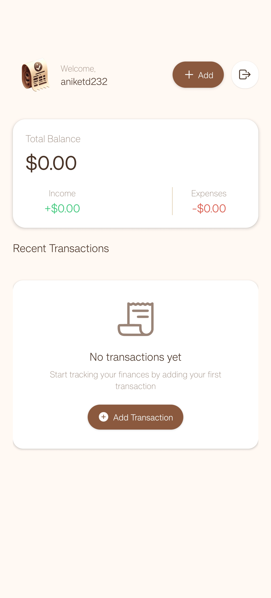
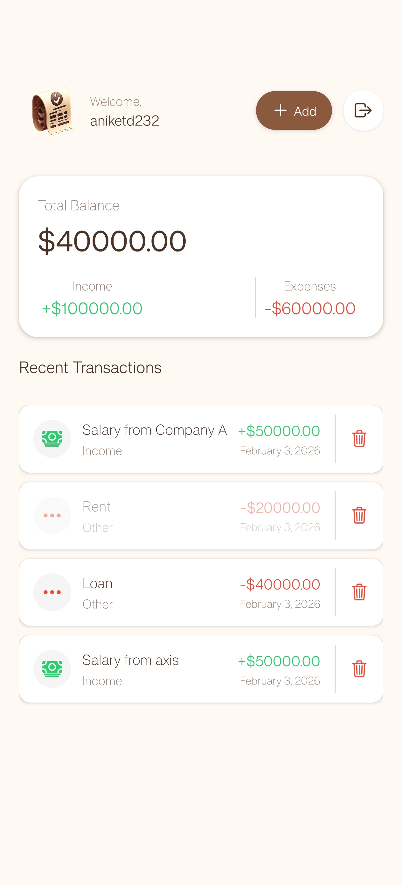
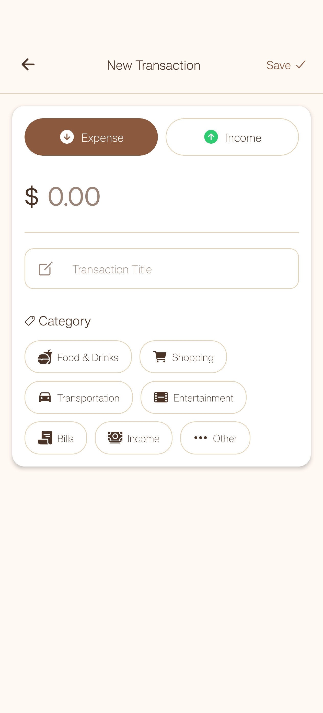

# Expense Tracker Mobile Client (React Native)

A mobile-only React Native application for tracking personal expenses and income.  
This app allows users to sign up, sign in, view their balance and transactions, and add new financial records in real time.

> ⚠️ This repository contains **only the mobile client**.  
> The backend API is hosted in a separate repository.

---

## Features

- 🔐 User Authentication (Sign Up & Sign In)
- 📊 Dashboard showing:
  - Total Balance
  - Total Expenses
  - Transaction History
- ➕ Add New Transactions (Income & Expenses)
- 📱 Mobile UI (Android & iOS support)
- 🌐 API Integration with External Backend

---

## 📸 Screenshots

<p align="center">
  
  
  
  
  
</p>

---

## Screens

- **Sign In** — Login to your account
- **Sign Up** — Create new account
- **Verification** — Verify new user via OTP sent to mail
- **Home** — View balance, expenses, and transactions
- **Create Transaction** — Add a new income or expense entry

---

## 🛠 Tech Stack

- **Framework:** React Native (Expo)
- **Navigation:** Expo Router
- **Authentication:** Clerk
- **State Management:** React Hooks
- **API Client:** Fetch / Axios
- **Linting:** ESLint

---

## Installation

Clone the repository:

```bash
git clone https://github.com/your-username/expense-tracker-mobile.git
cd expense-tracker-mobile
```

Install the dependencies:

```bash
npm install
```

Run the application:

```bash
npx expo
```

---

## 🔐 Environment Variables

This project uses the following environment variable for authentication and backend communication.

Create a `.env` file in the root directory and add:

```env
EXPO_PUBLIC_CLERK_PUBLISHABLE_KEY=your_clerk_publishable_key
```

> ⚠️ This is a **public key** required by Expo to configure Clerk authentication.  
> Do NOT commit your `.env` file to GitHub. Always use `.env.example` for reference.

---

## 🔑 How to Get Clerk Key

1. Go to https://clerk.com
2. Create or open your application
3. Navigate to **API Keys**
4. Copy the **Publishable Key**
5. Paste it into your `.env` file

---

## Run on Device

Scan QR code using Expo Go App (Android/iOS).  
Or run on emulator:

```bash
npx expo run:android
npx expo run:ios
```

---

## 📁 Folder Structure

```bash
expense-tracker-mobile/
├── app/
│   ├── (auth)/
│   │   ├── _layout.jsx
│   │   ├── sign-in.jsx
│   │   └── sign-up.jsx
│   │
│   ├── (root)/
│   │   ├── _layout.jsx
│   │   ├── create.jsx
│   │   └── index.jsx
│   │
│   └── _layout.jsx
│
├── assets/
│   ├── fonts/
│   ├── images/
│   └── styles/
│
├── components/
│   ├── BalanceCard.jsx
│   ├── NoTransactionsFound.jsx
│   ├── PageLoader.jsx
│   ├── SafeScreen.jsx
│   ├── SignOutButton.jsx
│   └── TransactionItem.jsx
│
├── constants/
│   ├── api.js
│   └── colors.js
│
├── hooks/
│   └── useTransactions.js
│
├── lib/
│   └── utils.js
│
├── .env
├── .gitignore
├── app.json
├── eslint.config.js
├── expo-env.d.ts
├── package-lock.json
├── package.json
├── README_EXPO.md
├── LICENCE
├── README.md
└── tsconfig.json
```

---

## Backend Repository

Link - https://github.com/AniketJas/expense-tracker-api.git

---

## License

This project is licensed under the MIT License.

---

## Author

Aniket Jas  
GitHub: https://github.com/AniketJas

---

## Support

If you find this project helpful, consider giving it a star on GitHub!
